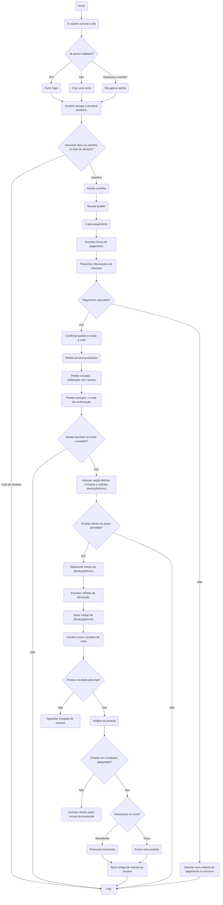

```mermaid
graph TD;
    A(Início) --> B(O usuário acessa o site);
    B --> C{Já possui cadastro?};
    C -- Sim --> D(Fazer login);
    C -- Não --> E(Criar uma conta);
    C -- Esqueceu a senha? --> F(Recuperar senha);
    D --> G(Usuário navega e visualiza produtos);
    E --> G;
    F --> G;
    G --> H{Adicionar itens ao carrinho ou lista de desejos?};
    H -- Lista de desejos --> Z[FIM];
    H -- Carrinho --> I(Fechar carrinho);
    I --> J(Revisar pedido);
    J --> K(Ir para pagamento);
    K --> L(Escolher forma de pagamento);
    L --> M(Preencher informações de checkout);
    M --> N{Pagamento aprovado?};
    N -- Sim --> O(Confirmar pedido e enviar e-mail);
    N -- Não --> P(Solicitar novo método de pagamento ou encerrar);
    P --> Z;
    O --> Q(Pedido em processamento);
    Q --> R(Pedido enviado - notificação com rastreio);
    R --> S(Pedido entregue - e-mail de confirmação);
    S --> T{Deseja devolver ou trocar o produto?};
    T -- Não --> Z;
    T -- Sim --> U(Acessar seção Minhas Compras e solicitar devolução/troca);
    U --> V{Produto dentro do prazo permitido?};
    V -- Sim --> W(Selecionar motivo da devolução/troca);
    V -- Não --> Z;
    W --> X(Escolher método de devolução);
    X --> Y(Gerar código de devolução/envio);
    Y --> AA(Usuário envia o produto de volta);
    AA --> BB{Produto recebido pela loja?};
    BB -- Não --> CC(Aguardar chegada do produto);
    BB -- Sim --> DD(Análise do produto);
    DD --> EE{Produto em condições adequadas?};
    EE -- Não --> FF(Informar cliente sobre recusa da devolução);
    EE -- Sim --> GG{Reembolso ou troca?};
    GG -- Reembolso --> HH(Processar reembolso);
    GG -- Troca --> II(Enviar novo produto);
    HH --> JJ(Confirmação do reembolso ao usuário);
    II --> JJ(Novo código de rastreio ao usuário);
    JJ --> Z;
```
